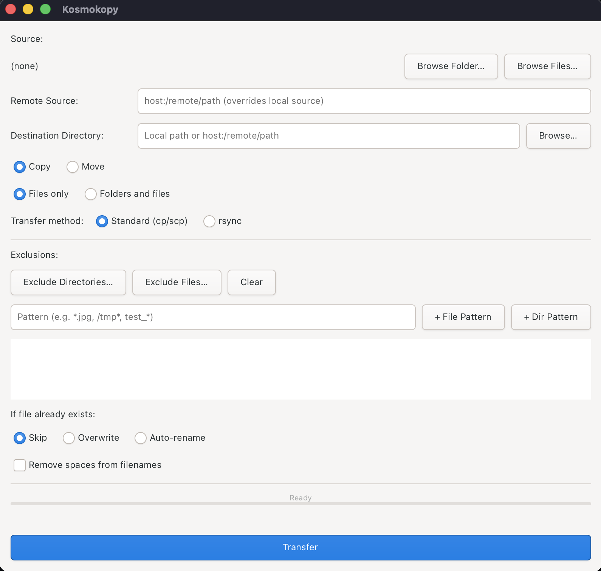

# Kosmokopy

A GTK4 file copier and mover with filtering, integrity verification, and SSH remote transfer support.

IMPORTANT: This is an ALPHA VERSION. It may corrupt files and completely destroy your data. TEST AT YOUR OWN RISK!

 

## Screenshot



## Features

### Source Selection

- **Browse Folder** — select a local directory and recursively process all files within it
- **Browse Files** — pick individual local files for transfer
- **Remote source** — type `host:/remote/path` in the "Remote source" field to pull files from a remote machine (overrides local source selection when filled in)

### Transfer Modes

- **Copy** — duplicate files to the destination
- **Move** — transfer files to the destination and remove the original
- **Files Only** — flatten all files into the destination directory (no subdirectories)
- **Folders and Files** — preserve the original directory structure at the destination

### Transfer Method

- **Standard (cp/scp)** — uses built-in Rust file copy for local transfers and `scp` for remote transfers (default)
- **rsync** — uses `rsync` for both local and remote transfers, providing:
  - **Resumable transfers** — interrupted large file copies can be picked up where they left off
  - **Delta transfers** — when overwriting, only changed blocks are written
  - **Checksum verification** — rsync verifies integrity during transfer with `--checksum`
  - For remote transfers, rsync uses SSH connection multiplexing for performance

### Exclusions

- **Exclude Directories** — pick directories to skip (all contents are excluded recursively)
- **Exclude Files** — pick individual filenames to skip wherever they appear
- **+ File Pattern** — manually enter a wildcard pattern to exclude matching filenames (e.g. `*.jpg`, `test_*`)
- **+ Dir Pattern** — manually enter a wildcard pattern to exclude matching directory names (e.g. `tmp*`, `.git*`)
- **Clear** — remove all exclusion rules
- Exclusions are displayed in a read-only scrollable list

**Wildcard patterns** support `*` (matches zero or more characters) and `?` (matches exactly one character). Matching is case-insensitive and applies to the file or directory **name** only (not the full path). For example, `te*` will match a file named `test.jpg` regardless of where it sits in the directory tree, but will not match a file inside a directory called `test/`.

### Conflict Handling

When a file already exists at the destination, Kosmokopy offers three strategies selected via the `--conflict` flag (CLI) or radio buttons (GUI):

| Destination file  | Content         | Skip mode                         | Overwrite mode                | Rename mode                                    |
| ----------------- | --------------- | --------------------------------- | ----------------------------- | ---------------------------------------------- |
| Doesn't exist     | —              | Copy/move normally                | Copy/move normally            | Copy/move normally                             |
| Exists, identical | Same bytes      | Skip ("identical at destination") | Skip (identical)              | Skip (identical)                               |
| Exists, different | Different bytes | Skip ("already exists")           | Overwrite with source version | Keep original, save source as `file (1).ext` |

In **Move** mode, the source file is deleted after a successful transfer (or immediately if the destination is already identical). In **Rename** mode, the counter increments (`file (1).ext`, `file (2).ext`, …) until an unused name is found.

### Integrity Verification

**Local transfers:**

- Every file copy is verified byte-by-byte against the source
- If verification fails on copy, the bad copy is removed
- If verification fails on move, the original is retained
- Same-filesystem moves use `rename()` (instant pointer change, no data copied)
- When using rsync locally, a byte-by-byte comparison is still performed after rsync's own checksum verification (defense in depth)

**Remote transfers (SCP and rsync):**

- After each file transfer, a SHA-256 hash of the local file is compared against a SHA-256 hash computed on the remote host via SSH
- If the hash comparison fails, the corrupt remote copy is removed and the original is retained
- Source files are **never** deleted during a move unless the hash verification passes
- For rsync, this SHA-256 check is performed in addition to rsync's built-in `--checksum` verification

### SSH Remote Transfers

Transfer files to or from remote machines, or between two remote machines, using SSH config hosts:

**Local → Remote:**

- Type `hostname:/remote/path` in the destination field (e.g. `ubuntu:/home/dan/backup`)

**Remote → Local:**

- Type `hostname:/remote/path` in the "Remote source" field
- Set a local destination folder

**Remote → Remote:**

- Type `source_host:/path` in the "Remote source" field
- Type `dest_host:/path` in the destination field
- Files are relayed through the local machine: downloaded from source, verified, uploaded to destination, verified again
- The local machine acts as a secure intermediary — files are staged in a temporary directory that is cleaned up after transfer

**Common remote features:**

- Hostnames must match entries in `~/.ssh/config`
- Uses SSH connection multiplexing for performance
- Creates remote directories automatically
- Remote conflict detection checks existing files before transfer (skip, overwrite, or rename)
- Post-transfer SHA-256 hash verification ensures data integrity
- Source files are deleted only after hash verification passes (move mode)
- Both Standard (scp) and rsync methods are supported for all remote transfer directions

### Progress and Reporting

- Real-time progress bar showing file count and current filename
- Completion dialog with summary of copied, skipped, and excluded files
- Detailed skip reasons (identical, already exists, different version)
- Scrollable error list if any transfers fail

## Requirements

### Build Dependencies

- Rust toolchain (edition 2021, Cargo 1.70+)
- GTK4 development libraries

#### macOS

```bash
brew install gtk4
```

#### Ubuntu / Debian

```bash
sudo apt install libgtk-4-dev build-essential
```

### Runtime Dependencies

- GTK4 runtime libraries
- `ssh` and `scp` (only for remote transfers via Standard method — present on any system with SSH configured)
- `rsync` (only when rsync transfer method is selected — commonly pre-installed on macOS and Linux)
- `sha256sum` or `shasum` on the remote host (for remote transfer hash verification — present on virtually all Unix systems)

## Building

### From Source

```bash
cargo build --release
```

The binary is at `target/release/kosmokopy`.

### macOS (.dmg)

```bash
./macos/build-dmg.sh
```

Creates `target/macos/Kosmokopy-0.1.0-arm64.dmg` containing a drag-to-install `.app` bundle.

> **Note:** GTK4 must be installed via Homebrew on the target Mac.

### Linux (AppImage)

```bash
./appimage/build-appimage.sh
```

Creates a portable `target/appimage/Kosmokopy-0.1.0-x86_64.AppImage`.

> **Note:** GTK4 runtime libraries must be installed on the target system.

## Usage

1. **Select source** — choose one of:
   - Click "Browse Folder" for a local directory
   - Click "Browse Files" for individual local files
   - Type `host:/remote/path` in the "Remote source" field for a remote source
2. **Set destination** — browse for a local folder, type a local path, or enter `host:/path` for a remote destination
3. **Choose mode** — Copy or Move, Files Only or Folders and Files
4. **Choose transfer method** — Standard (cp/scp) or rsync
5. **Set exclusions** (optional) — use the picker buttons or type wildcard patterns (e.g. `*.log`, `tmp*`) and click "+ File Pattern" or "+ Dir Pattern"
6. **Choose conflict handling** (optional) — select Skip (default), Overwrite, or Rename to control how filename collisions are resolved
7. **Click Transfer**

### Transfer Scenarios

| Source             | Destination     | How it works                                                             |
| ------------------ | --------------- | ------------------------------------------------------------------------ |
| Local folder/files | Local path      | Direct file copy/move with byte-by-byte verification                     |
| Local folder/files | `host:/path`  | Upload via SCP or rsync with SHA-256 verification                        |
| `host:/path`     | Local path      | Download via SCP or rsync with SHA-256 verification                      |
| `host1:/path`    | `host2:/path` | Download to local temp → verify → upload to dest → verify → clean up |

## Test Suite

Kosmokopy includes an external Python test suite that exercises the real Rust binary via its `--cli` headless mode, then verifies results in Python.

### What It Tests

| Test file              | What it covers                                                                                                                                                                                                                                                                                                                                                                              |
| ---------------------- | ------------------------------------------------------------------------------------------------------------------------------------------------------------------------------------------------------------------------------------------------------------------------------------------------------------------------------------------------------------------------------------------- |
| `test_local.py`      | Local copy and move (standard + rsync), directory structure preservation, strip-spaces, destination auto-creation                                                                                                                                                                                                                                                                           |
| `test_conflicts.py`  | All three conflict modes — Skip, Overwrite, Rename — for both local and remote destinations, including the `(1)`, `(2)`, … auto-rename numbering scheme                                                                                                                                                                                                                              |
| `test_exclusions.py` | Exact directory and file exclusions, wildcard directory and file exclusions (`*`, `?`), combined exclusion rules, case-insensitive matching                                                                                                                                                                                                                                             |
| `test_integrity.py`  | Byte-by-byte identity after copy, SHA-256 hash verification, empty & large binary files, move-mode source deletion, rsync integrity,**plus 30 negative/corruption tests** — single-byte flip, appended byte, truncation, content replacement, file deletion, empty↔nonempty swap, nested corruption, remote corruption (append/truncate/replace/delete), and hash-helper self-tests |
| `test_remote.py`     | Local→remote (SCP + rsync), remote→local (SCP + rsync), remote→remote relay (SCP + rsync), move-mode source deletion, conflict handling on remote, exclusions, strip-spaces, real source directory upload                                                                                                                                                                                |

### How It Works

Every test invokes `kosmokopy --cli` (the headless mode) via Python's `subprocess` module. The Rust binary performs the actual file operation and prints a JSON result. Python then inspects the destination filesystem (or remote host via SSH) to verify correctness — file existence, SHA-256 hash match, source deletion (for moves), and correct error handling.

Remote tests use real SSH connections and are automatically **skipped** when the remote host environment variables are not set.

### Negative / Corruption Tests

The integrity test file includes 30 negative tests that prove the verification checks genuinely catch data corruption. The methodology is:

1. **Copy files** using `kosmokopy --cli` (the real Rust binary performs the transfer)
2. **Verify** the copy is intact (SHA-256 hash match, byte-identical comparison)
3. **Deliberately corrupt** the destination file using one of the techniques below
4. **Assert** that `sha256_of_file()` and `files_are_identical()` now detect the mismatch

#### Corruption techniques used

| Technique                       | How it works                                                    | What it proves                                      |
| ------------------------------- | --------------------------------------------------------------- | --------------------------------------------------- |
| **Single-byte flip**      | XOR one byte at the midpoint with `0xFF`                      | Detects minimal single-bit corruption               |
| **Appended byte**         | Write `\x00` at end of file                                   | Detects extra data appended after transfer          |
| **Truncation**            | Rewrite file with only the first half of its content            | Detects incomplete or truncated transfers           |
| **Content replacement**   | Replace entire file contents with different text of same length | Detects wholesale content substitution              |
| **File deletion**         | Remove the destination file entirely                            | Detects missing files                               |
| **Empty → non-empty**    | Write data into a previously zero-byte file                     | Detects corruption of empty files                   |
| **Non-empty → empty**    | Truncate a file to zero bytes                                   | Detects total data loss                             |
| **Nested corruption**     | Corrupt files 1 and 2 levels deep in subdirectories             | Proves checks work at any directory depth           |
| **Pinpointed corruption** | Corrupt one file among many, verify the rest are still intact   | Proves corruption detection is per-file, not global |

#### Coverage across transfer modes

Each corruption technique is tested after transfers using:

- **Standard local copy** (9 tests) — single byte flip, append, truncate, replace, delete, empty↔nonempty swap, nested, deeply nested
- **rsync local copy** (3 tests) — byte flip, truncation, content replacement
- **Move mode** (2 tests) — corrupt after move, pinpoint one corrupted file among many
- **Flat / files-only mode** (1 test) — corruption in flattened output
- **Strip-spaces mode** (1 test) — corruption after space-stripping renames
- **Remote upload** (5 tests) — append, truncate, replace, and delete the remote file via SSH; pinpoint one corrupted remote file
- **Remote download** (3 tests) — corrupt, truncate, and delete the local copy; verify against still-intact remote

#### Hash helper self-tests (6 tests)

The `sha256_of_file()` and `files_are_identical()` helpers are themselves validated:

- Identical files → match
- Different files → mismatch
- Same size, different content → mismatch
- One-byte difference → mismatch
- Empty vs non-empty → mismatch
- Both empty → match

### CLI Mode

The `--cli` flag runs the application headlessly (no GTK window). It accepts the same options as the GUI but as command-line arguments:

```
kosmokopy --cli --src <dir> --dst <dir> [options]
```

| Flag                                   | Description                                                  |
| -------------------------------------- | ------------------------------------------------------------ |
| `--src <path>`                       | Source directory                                             |
| `--dst <path>`                       | Destination directory (local or `host:/path`)              |
| `--src-files <a,b,c>`                | Comma-separated list of individual source files              |
| `--move`                             | Move instead of copy                                         |
| `--conflict <skip\|overwrite\|rename>` | Conflict resolution strategy (default:`skip`)              |
| `--strip-spaces`                     | Remove spaces from destination filenames and directory names |
| `--mode <files\|folders>`             | Transfer mode (default:`folders`)                          |
| `--method <standard\|rsync>`          | Transfer method (default:`standard`)                       |
| `--exclude <pattern>`                | Exclusion pattern (repeatable)                               |

Output is a single JSON line:

```json
{"status":"finished","copied":3,"skipped":[],"excluded_files":0,"excluded_dirs":0,"errors":[]}
```

### Running the Tests

**Prerequisites:** Python 3.9+, pipenv, pytest

```bash
# Install test dependencies (one-time)
pipenv install --dev pytest

# Run all local tests
pipenv run python -m pytest tests/ -v

# Run a specific test file
pipenv run python -m pytest tests/test_integrity.py -v

# Run a specific test class
pipenv run python -m pytest tests/test_exclusions.py::TestWildcardMatching -v
```

### Enabling Remote Tests

Remote tests require SSH access to one or two hosts listed in `~/.ssh/config`. Set the following environment variables before running:

```bash
# Single remote host (local↔remote tests)
export KOSMOKOPY_TEST_REMOTE_HOST="myserver"          # or "user@myserver"
export KOSMOKOPY_TEST_REMOTE_PATH="/tmp/kosmokopy_test"

# Second remote host (remote→remote relay tests)
export KOSMOKOPY_TEST_REMOTE_HOST2="otherserver"
export KOSMOKOPY_TEST_REMOTE_PATH2="/tmp/kosmokopy_test2"

# Optional: real source directory (uploads first 10 files and verifies hashes)
export KOSMOKOPY_TEST_SOURCE_DIR="/path/to/real/files"

pipenv run python -m pytest tests/ -v
```

Remote test directories are created automatically and cleaned up after each test.

### Test Reports

A timestamped report file is automatically generated after every test run and saved to `tests/reports/`. Each report includes:

- Date, duration, platform, Python version, binary path
- Remote host configuration
- Full pass/fail/skip summary with counts
- Failure details (traceback) for any failed tests
- Complete list of all passed and skipped tests

Report filenames follow the pattern `report_YYYY-MM-DD_HHMMSS.txt`.

## Author

**Dan Bright** — [dan@danbright.uk](mailto:dan@danbright.uk)

This code was primarily authored using artificial intelligence (Claude Opus 4.6 model).

## License

Copyright (C) 2026 Dan Bright

This project is licensed under the **GNU General Public License v3.0** — see [LICENSE](LICENSE) for details.

All third-party dependency licenses (MIT, Apache-2.0, Unlicense) are bundled in [THIRD-PARTY-LICENSES.txt](THIRD-PARTY-LICENSES.txt).

## Changelog

### 2026-02-20

- **Added `--cli` headless mode** — run all transfer operations from the command line without opening a GTK window; accepts `--src`, `--dst`, `--move`, `--conflict`, `--strip-spaces`, `--mode`, `--method`, `--exclude` and prints a JSON result
- **Rewrote test suite to use the real binary** — all 106 tests now invoke `kosmokopy --cli` via subprocess; Python only verifies results (file existence, SHA-256 hashes, source deletion)
- **Added 30 negative/corruption tests** — deliberately tamper with copied files (single-byte flip, append, truncate, replace, delete, empty↔nonempty) and verify that SHA-256 and byte-comparison checks catch every corruption; covers local standard, rsync, move, flat mode, strip-spaces, remote upload, and remote download scenarios; includes hash-helper self-tests
- **Automatic test report generation** — a timestamped report is saved to `tests/reports/` after every pytest run, including platform info, remote host config, duration, and full pass/fail/skip breakdown with failure details

### 2026-02-19

- **Added conflict mode selection** — new `ConflictMode` enum (Skip / Overwrite / Rename) replaces the boolean overwrite toggle; radio buttons in the UI let users choose how filename collisions are handled
- **Auto-rename on conflict** — when Rename mode is selected, conflicting files are saved as `file (1).ext`, `file (2).ext`, etc.; works for both local and remote destinations
- **Added external Python test suite** — 104 tests across 5 files (`test_local`, `test_conflicts`, `test_exclusions`, `test_integrity`, `test_remote`) covering local/remote copy and move, all conflict modes, wildcard exclusions, SHA-256 verification, corruption detection, and remote-to-remote relay; remote tests auto-skip when environment variables are unset
- **Added remote source support** — new "Remote source" text entry field accepts `host:/path` to pull files from a remote machine; overrides local source selection when filled in
- **Added remote-to-local transfers** — download files from a remote host to a local destination with SHA-256 hash verification; supports both SCP and rsync methods
- **Added remote-to-remote transfers** — transfer files between two remote hosts using the local machine as a secure relay; files are downloaded, verified, uploaded, and verified again before source deletion (move mode)
- **Added wildcard exclusion patterns** — new "+ File Pattern" and "+ Dir Pattern" buttons allow manual entry of `*` and `?` wildcard patterns for flexible exclusion matching
- **Added rsync transfer method** — available for both local and remote transfers via a new "Transfer method" radio button group (Standard / rsync)
- **Added SHA-256 hash verification for remote transfers** — both SCP and rsync remote transfers now verify integrity by comparing local and remote SHA-256 hashes after each file transfer
- **Hardened SCP remote move safety** — source files are no longer deleted after SCP transfer without cryptographic hash verification; previously relied solely on SCP exit status
- **Local rsync worker** — uses `rsync -a --checksum` with a follow-up byte-by-byte comparison for defense in depth; same-filesystem moves still use atomic `rename()`
- **Remote rsync worker** — uses `rsync -az --checksum` over SSH with connection multiplexing, plus post-transfer SHA-256 verification before any source deletion
- **Added `sha2` crate dependency** for local SHA-256 hash computation
- **Updated runtime requirements** — documented `rsync` and `sha256sum`/`shasum` as optional runtime dependencies
