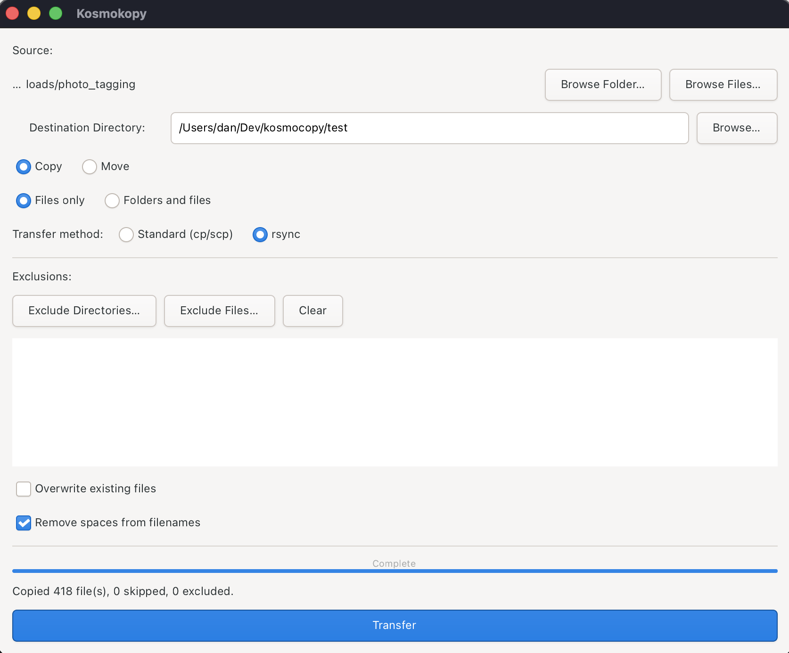

# Kosmokopy

A GTK4 file copier and mover with filtering, integrity verification, and SSH remote transfer support.

IMPORTANT: This is an ALPHA VERSION. It may corrupt files and completely destroy your data. TEST AT YOUR OWN RISK!

 

## Screenshot



## Features

### Source Selection

- **Browse Folder** — select a local directory and recursively process all files within it
- **Browse Files** — pick individual local files for transfer
- **Remote source** — type `host:/remote/path` in the "Remote source" field to pull files from a remote machine (overrides local source selection when filled in)

### Transfer Modes

- **Copy** — duplicate files to the destination
- **Move** — transfer files to the destination and remove the original
- **Files Only** — flatten all files into the destination directory (no subdirectories)
- **Folders and Files** — preserve the original directory structure at the destination

### Transfer Method

- **Standard (cp/scp)** — uses built-in Rust file copy for local transfers and `scp` for remote transfers (default)
- **rsync** — uses `rsync` for both local and remote transfers, providing:
  - **Resumable transfers** — interrupted large file copies can be picked up where they left off
  - **Delta transfers** — when overwriting, only changed blocks are written
  - **Checksum verification** — rsync verifies integrity during transfer with `--checksum`
  - For remote transfers, rsync uses SSH connection multiplexing for performance

### Exclusions

- **Exclude Directories** — pick directories to skip (all contents are excluded recursively)
- **Exclude Files** — pick individual filenames to skip wherever they appear
- **+ File Pattern** — manually enter a wildcard pattern to exclude matching filenames (e.g. `*.jpg`, `test_*`)
- **+ Dir Pattern** — manually enter a wildcard pattern to exclude matching directory names (e.g. `tmp*`, `.git*`)
- **Clear** — remove all exclusion rules
- Exclusions are displayed in a read-only scrollable list

**Wildcard patterns** support `*` (matches zero or more characters) and `?` (matches exactly one character). Matching is case-insensitive and applies to the file or directory **name** only (not the full path). For example, `te*` will match a file named `test.jpg` regardless of where it sits in the directory tree, but will not match a file inside a directory called `test/`.

### Overwrite Handling

Kosmokopy compares source and destination files byte-by-byte before deciding what to do:

| Destination file  | Content                            | Copy mode                         | Move mode                               |
| ----------------- | ---------------------------------- | --------------------------------- | --------------------------------------- |
| Doesn't exist     | —                                 | Copy normally                     | Move normally                           |
| Exists, identical | Same bytes                         | Skip ("identical at destination") | Delete source only (no transfer needed) |
| Exists, different | Different + overwrite**on**  | Overwrite with new version        | Overwrite, then delete source           |
| Exists, different | Different + overwrite**off** | Skip ("different version exists") | Skip                                    |

### Integrity Verification

**Local transfers:**

- Every file copy is verified byte-by-byte against the source
- If verification fails on copy, the bad copy is removed
- If verification fails on move, the original is retained
- Same-filesystem moves use `rename()` (instant pointer change, no data copied)
- When using rsync locally, a byte-by-byte comparison is still performed after rsync's own checksum verification (defense in depth)

**Remote transfers (SCP and rsync):**

- After each file transfer, a SHA-256 hash of the local file is compared against a SHA-256 hash computed on the remote host via SSH
- If the hash comparison fails, the corrupt remote copy is removed and the original is retained
- Source files are **never** deleted during a move unless the hash verification passes
- For rsync, this SHA-256 check is performed in addition to rsync's built-in `--checksum` verification

### SSH Remote Transfers

Transfer files to or from remote machines, or between two remote machines, using SSH config hosts:

**Local → Remote:**

- Type `hostname:/remote/path` in the destination field (e.g. `ubuntu:/home/dan/backup`)

**Remote → Local:**

- Type `hostname:/remote/path` in the "Remote source" field
- Set a local destination folder

**Remote → Remote:**

- Type `source_host:/path` in the "Remote source" field
- Type `dest_host:/path` in the destination field
- Files are relayed through the local machine: downloaded from source, verified, uploaded to destination, verified again
- The local machine acts as a secure intermediary — files are staged in a temporary directory that is cleaned up after transfer

**Common remote features:**

- Hostnames must match entries in `~/.ssh/config`
- Uses SSH connection multiplexing for performance
- Creates remote directories automatically
- Remote overwrite detection checks existing files before transfer
- Post-transfer SHA-256 hash verification ensures data integrity
- Source files are deleted only after hash verification passes (move mode)
- Both Standard (scp) and rsync methods are supported for all remote transfer directions

### Progress and Reporting

- Real-time progress bar showing file count and current filename
- Completion dialog with summary of copied, skipped, and excluded files
- Detailed skip reasons (identical, already exists, different version)
- Scrollable error list if any transfers fail

## Requirements

### Build Dependencies

- Rust toolchain (edition 2021, Cargo 1.70+)
- GTK4 development libraries

#### macOS

```bash
brew install gtk4
```

#### Ubuntu / Debian

```bash
sudo apt install libgtk-4-dev build-essential
```

### Runtime Dependencies

- GTK4 runtime libraries
- `ssh` and `scp` (only for remote transfers via Standard method — present on any system with SSH configured)
- `rsync` (only when rsync transfer method is selected — commonly pre-installed on macOS and Linux)
- `sha256sum` or `shasum` on the remote host (for remote transfer hash verification — present on virtually all Unix systems)

## Building

### From Source

```bash
cargo build --release
```

The binary is at `target/release/kosmokopy`.

### macOS (.dmg)

```bash
./macos/build-dmg.sh
```

Creates `target/macos/Kosmokopy-0.1.0-arm64.dmg` containing a drag-to-install `.app` bundle.

> **Note:** GTK4 must be installed via Homebrew on the target Mac.

### Linux (AppImage)

```bash
./appimage/build-appimage.sh
```

Creates a portable `target/appimage/Kosmokopy-0.1.0-x86_64.AppImage`.

> **Note:** GTK4 runtime libraries must be installed on the target system.

## Usage

1. **Select source** — choose one of:
   - Click "Browse Folder" for a local directory
   - Click "Browse Files" for individual local files
   - Type `host:/remote/path` in the "Remote source" field for a remote source
2. **Set destination** — browse for a local folder, type a local path, or enter `host:/path` for a remote destination
3. **Choose mode** — Copy or Move, Files Only or Folders and Files
4. **Choose transfer method** — Standard (cp/scp) or rsync
5. **Set exclusions** (optional) — use the picker buttons or type wildcard patterns (e.g. `*.log`, `tmp*`) and click "+ File Pattern" or "+ Dir Pattern"
6. **Toggle overwrite** (optional) — check "Overwrite existing files" to replace differing files
7. **Click Transfer**

### Transfer Scenarios

| Source | Destination | How it works |
|--------|-------------|-------------|
| Local folder/files | Local path | Direct file copy/move with byte-by-byte verification |
| Local folder/files | `host:/path` | Upload via SCP or rsync with SHA-256 verification |
| `host:/path` | Local path | Download via SCP or rsync with SHA-256 verification |
| `host1:/path` | `host2:/path` | Download to local temp → verify → upload to dest → verify → clean up |

## Author

**Dan Bright** — [dan@danbright.uk](mailto:dan@danbright.uk)

This code was primarily authored using artificial intelligence (Claude Opus 4.6 model).

## License

Copyright (C) 2026 Dan Bright

This project is licensed under the **GNU General Public License v3.0** — see [LICENSE](LICENSE) for details.

All third-party dependency licenses (MIT, Apache-2.0, Unlicense) are bundled in [THIRD-PARTY-LICENSES.txt](THIRD-PARTY-LICENSES.txt).

## Changelog

### 2026-02-19

- **Added remote source support** — new "Remote source" text entry field accepts `host:/path` to pull files from a remote machine; overrides local source selection when filled in
- **Added remote-to-local transfers** — download files from a remote host to a local destination with SHA-256 hash verification; supports both SCP and rsync methods
- **Added remote-to-remote transfers** — transfer files between two remote hosts using the local machine as a secure relay; files are downloaded, verified, uploaded, and verified again before source deletion (move mode)
- **Added wildcard exclusion patterns** — new "+ File Pattern" and "+ Dir Pattern" buttons allow manual entry of `*` and `?` wildcard patterns for flexible exclusion matching
- **Added rsync transfer method** — available for both local and remote transfers via a new "Transfer method" radio button group (Standard / rsync)
- **Added SHA-256 hash verification for remote transfers** — both SCP and rsync remote transfers now verify integrity by comparing local and remote SHA-256 hashes after each file transfer
- **Hardened SCP remote move safety** — source files are no longer deleted after SCP transfer without cryptographic hash verification; previously relied solely on SCP exit status
- **Local rsync worker** — uses `rsync -a --checksum` with a follow-up byte-by-byte comparison for defense in depth; same-filesystem moves still use atomic `rename()`
- **Remote rsync worker** — uses `rsync -az --checksum` over SSH with connection multiplexing, plus post-transfer SHA-256 verification before any source deletion
- **Added `sha2` crate dependency** for local SHA-256 hash computation
- **Updated runtime requirements** — documented `rsync` and `sha256sum`/`shasum` as optional runtime dependencies
